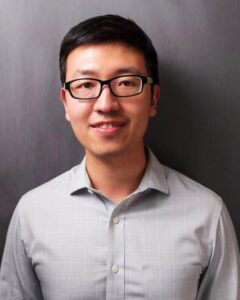

# Project Director

I am an Assistant Professor of Chemistry and also affiliated to the Data Science Institute. My group and I are actively exploring tremendous opportunities in the interface between computational chemical biology and data science. Born in Tianjin, China, I graduated from Nankai University with a B.S. degree in Chemistry (Po-Ling class) in 2013. I received my Ph.D. with Prof. K. N. Houk in the Department of Chemistry at the University of California, Los Angeles in 2017. During my graduate career, we developed computational tools to simulate single-molecule reaction trajectories in solvent and in enzyme, which enables the elucidation of time-resolved mechanisms of biomolecular transformations in the condensed environment. From 2018 to 2020, I was a postdoctoral scholar in the group of Prof. Heather J. Kulik in the Department of Chemical Engineering at Massachusetts Institute of Technology. During this time, we leveraged large-scale quantum mechanics computation and molecular dynamics simulations to quantify constrained-peptide switch, understand the catalytic origins of methyltransferases, and predict the catalytic actions of glycyl radical enzymes in human gut microbiota.

For more info, please visit my personal web: [Personal Website](https://lab.vanderbilt.edu/zyang-lab/)

---

# Teammember

<!---
## Sarah Torrence

**Master Student, Data Science Institute**

[sarah.k.torrence@Vanderbilt.Edu](sarah.k.torrence@Vanderbilt.Edu)

I am a current graduate student at Vanderbilt pursuing an MS in Data Science. I graduated from Denison University in 2016 with a degree in Mathematics and minor in Economics. Over the last five years, I’ve had the opportunity to grow as a data science professional in various fields and industries including education, criminology, financial services, and digital advertising. I am inspired by the way we can apply analytics and creativity to the data of our past to gain insights and create a better future.

## Yaoyukun Paul Jiang

**Postdoctoral Fellow, Department of Chemistry**

[yaoyukun.jiang@vanderbilt.edu](yaoyukun.jiang@vanderbilt.edu)

Paul Jiang works on developing new atomistic simulation methods for quantifying the influence of mutation. He also develops new strategies for sampling enzyme conformation across sequence space.

## Reecan Juarez

**Rotation Graduate Student, Quantitative & Structural Biology**

[reecan.j.juarez@Vanderbilt.Edu](reecan.j.juarez@Vanderbilt.Edu)

Reecan joined the lab between Jan 4th 2021 and Feb. 28th 2021. She develops strategies for converting the name of a chemical compound to a SMILE string.

## Xinchun Ran

**Graduate student, Department of Chemistry**

[xinchun.ran@vanderbilt.edu](xinchun.ran@vanderbilt.edu)

Xinchun is working on developing new machine learning algorithms for single- and multi-objective prediction of beneficial enzyme variants.

## Qianzhen Shao

**Volunteer Remote Undergraduate Student, Department of Chemistry**

[cv](https://cdn.vanderbilt.edu/vu-web/lab-wpcontent/sites/131/2021/03/28171042/Qianzhen-Shao-CV-short-%E9%82%B5%E4%B9%BE%E7%9C%9F.pdf)

Qianzhen develops a high-throughput modeling Python program, IntEnzyWF, for automatic construction, simulation, and analysis of enzyme using quantum mechanics and molecular mechanics theory.

## Matthew Thomas Tremblay

**Undergraduate student, Department of Chemistry**

[matthew.t.tremblay@vanderbilt.edu](matthew.t.tremblay@vanderbilt.edu)

Born and raised in Crystal Lake, IL, Matthew is currently pursuing a degree in Chemistry with a double major in Computer Science at Vanderbilt. His research centers on the analysis of the conformational states of chrysophaentin, an antibiotic macrocycle. Outside of the lab, he enjoys cooking, reading, and playing video games.

## Bailu Lucy Yan

**Research Assistant, Department of Chemistry**

[bailu.yan@vanderbilt.edu](bailu.yan@vanderbilt.edu)

Bailu is developing an integrated enzymology database (IntEnzyDB) for storing enzyme structure, kinetics, thermodynamics, and solubility. She will apply statistical inference methods to inform strategies for discovering beneficial enzyme variants.

## Li Yuan

**Master Student, Data Science Institute**

[li.yuan@vanderbilt.edu](li.yuan@vanderbilt.edu)

## Ryan Zhou

**Undergraduate student, Chemistry and Engineering Science**

[xiang.zhou@vanderbilt.edu](xiang.zhou@vanderbilt.edu)

Ryan is working on developing and testing high-throughput strategies for enzyme modeling.
>